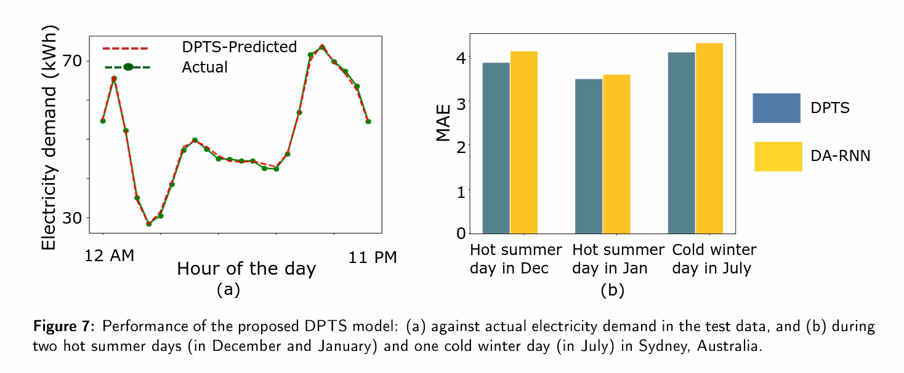

# Dual-phase attention mechanism for Electricty forecasting

## Problem Statement
- Energy demand prediction and peak demand prediction are challenging problems faced by electricity suppliers who need to match supply to demand
- A mismatch in supply and demand in either direction results in significant financial and reputational cost to suppliers
- Is it possible to build a model to predict the hourly electricity usage and also the daily demand peaks using real past data provided by an energy supplier?

## Results
- We showed the effectiveness of recurrent neural networks in predicting energy usage
- We improved upon the state-of-the-art dual-stage attention mechanism with a dual-phase + dual-stage setup that outperforms it
- Completed in collaboration with Data61 of CSIRO and Ausgrid, an energy supplier operating in New South Wales
- Publication detailing findings is currently in preparation
